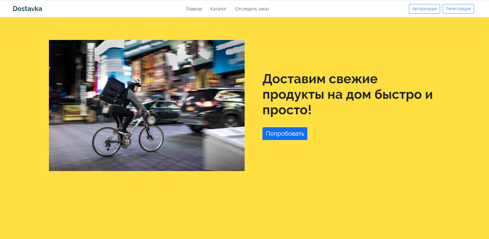
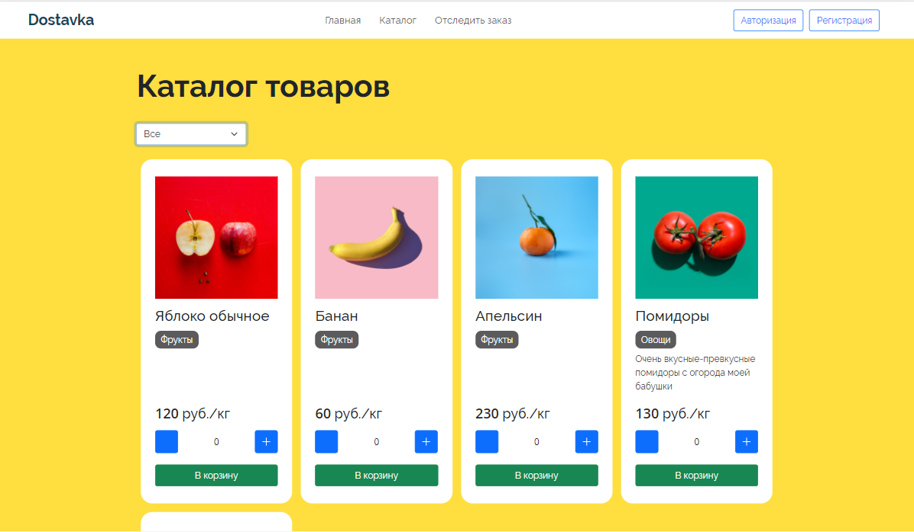
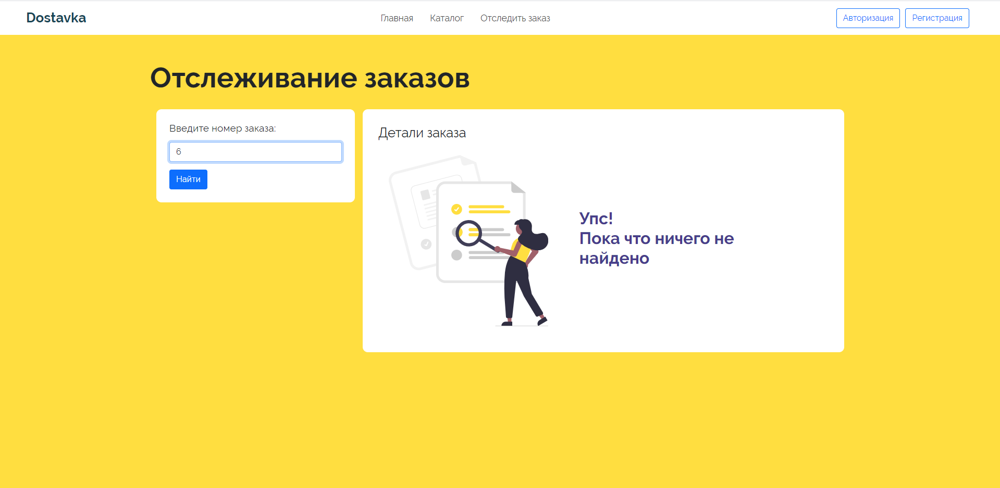
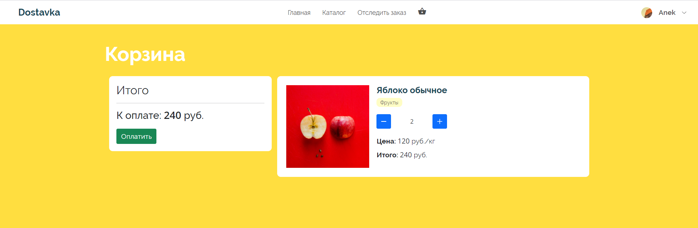

# Проект "Доставка продуктов"
Данный проект был реализован в рамках курсового проекта, главной задачей которого было создание веб-приложения с использованием микро-сервисной архитектуры
Предметной областью была выбрана сфера доставки продуктов, которая как никогда актуальна в наше время. 
##Реализованные сервисы
В ходе создания проекта и изучения предметной области было реализовано 5 сервисов:
- Сервис клиентов (регистрация, авторизация в системе, изменения личных данных и получение пользователя по id);
- Сервис каталога продуктов (выгрузка имеющихся товаров, фильтрация товаров по категориям);
- Сервис заказов (запись заказов, изменение статуса заказа, отслеживание заказа по id);
- Сервис корзины (добавление товара в корзину, изменение кол-ва товара в корзине, удаление товара из корзины, получение id корзины по id клиента, получение списков товаров корзины по id, обновление и удаление корзины по id);
- Сервис платежей (запись платежей, изменение статуса платежей, получение платежа по id).

## База данных
Для хранения данных проекта была выбрана СУБД MySQL, у каждого сервиса имеется своя часть бд, которая запускается в отдельном контейнере.
## Frontend
Frontend приложения представляет собой многостраничный сайт. При создании страниц использовались следующие технологии:
- Vue.js
- Vue-router
- Vue-resource 
- Bootstrap
## Backend
Серверная часть приложения написана на фреймворке Flask, взаимодействие между клиентом и сервером реализуется с
помощью протокола JSON-RPC 2.0.
##Запуск проекта
Запуск сервисов, баз данных и сайта происходит  в Docker-контейнерах, в качестве оркестратора контейнеров
используется Docker-compose. Для запуска образов
- соберите образ с помощью docker-compose build
- запустите сервисы с помощью докера docker-compose up -d

## Внешний вид сайта

